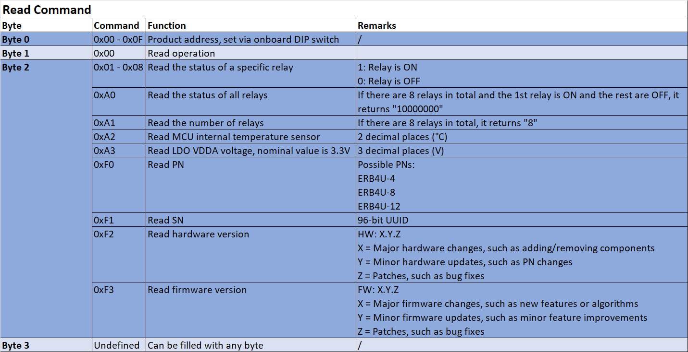

# ERB API & Example Code

 

- [English](README.md)
- [中文](README.zh-CN.md)

* **The ERB4U series is a relay module programmable via USART serial port.**
* **A PC needs only one USB Type-C cable to simultaneously read/control multiple daisy-chained relay modules.**
* **Individual Relay Output:** Up to 30VDC/10A, 1NO + 1NC
* **Total Relay Output:** Up to 30VDC/32A
* **Working Principle:** The ERB4U device receives commands from USB or J1 connector (USART1) and passes the original commands to downstream ERB4U devices through the J6 connector (USART2) to achieve expandable functionality. Upon receiving a command, the ERB4U checks its own address and will only act if the address is correct.
* **USART Functionality**
    - **USART Parameters:** 115200 baud rate, 8 data bits, 1 stop bit, odd parity, no flow control
    - **Read Commands:** Temperature, relay status, PN/SN, and other information of single/multiple ERB4Us
    - **Write Commands:** Turn ON/OFF status of single/multiple relays
* **Address Setting:** 4-bit DIP switch sets addresses from 0 to 15, with multiple ERB4Us able to use the same address simultaneously
* **Protection Circuits**
    - Input reverse polarity protection
    - Optocoupler relay isolation between MCU and relay
    - Supports resistive (R) or inductive (L) loads
* **Python API & Example Code:** Available for download from GitHub
* **Operating Temperature:** -40 to 85 ℃

<table style="width:100%; text-align:center;">
  <tr>
    <td style="width: 50%;">
      
    </td>
    <td style="width: 50%;">
      
    </td>
  </tr>
</table>

    

    

<table style="width:100%; text-align:center;">
  <tr>
    <td style="width: 50%;">
      
    </td>
    <td style="width: 50%;">
      
    </td>
  </tr>
</table>

## Communication Protocol
### Read Command

  

### Write Command

  

### Error Message

  

## Drawings
### 2D Drawings: [Download](https://altita-tech.com/wp-content/uploads/ERB4U/ERB4U-8%202D.zip)
<table style="width:100%; text-align:center;">
  <tr>
    <td style="width: 50%; padding: 10px;">
      

        
      

    </td>
  </tr>
</table>

### 3D Model: [Download](https://altita-tech.com/wp-content/uploads/PBT223/PBT223%203D.zip)
<table style="width:100%; text-align:center;">
  <tr>
    <td style="width: 40%;">
      
    </td>
    <td style="width: 40%;">
      
    </td>
  </tr>
</table>

## Functional Block Diagram
<table style="width:100%; text-align:center;">
  <tr>
    <td style="width: 100%;">
      
    </td>
  </tr>
</table>

## Video Tutorial

## Contact Us

  

    <ul style="list-style-type: disc; padding-left: 20px; margin: 0;">
      <li><strong>Company Website:</strong> <a href="https://altita-tech.com/">https://altita-tech.com/</a></li>
      <li><strong>Sales:</strong> <a href="mailto:sales@altita-tech.com">sales@altita-tech.com</a></li>
      <li><strong>Technical Support:</strong> <a href="mailto:tech@altita-tech.com">tech@altita-tech.com</a></li>
    </ul>
  

<table style="width:100%; text-align:center;">
  <tr>
    <td style="width: 100%;">
      
    </td>
  </tr>
</table>
