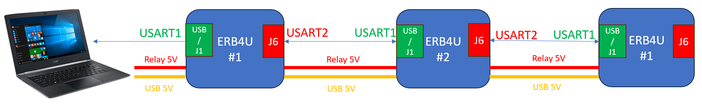
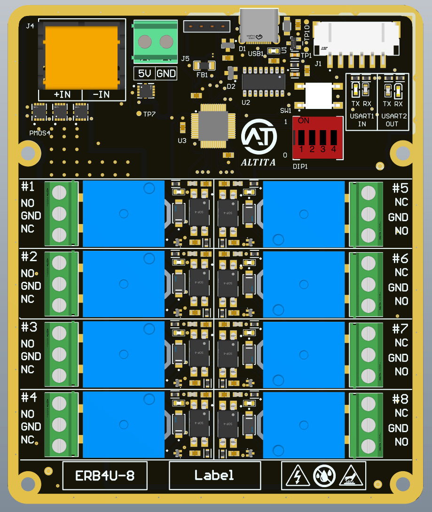
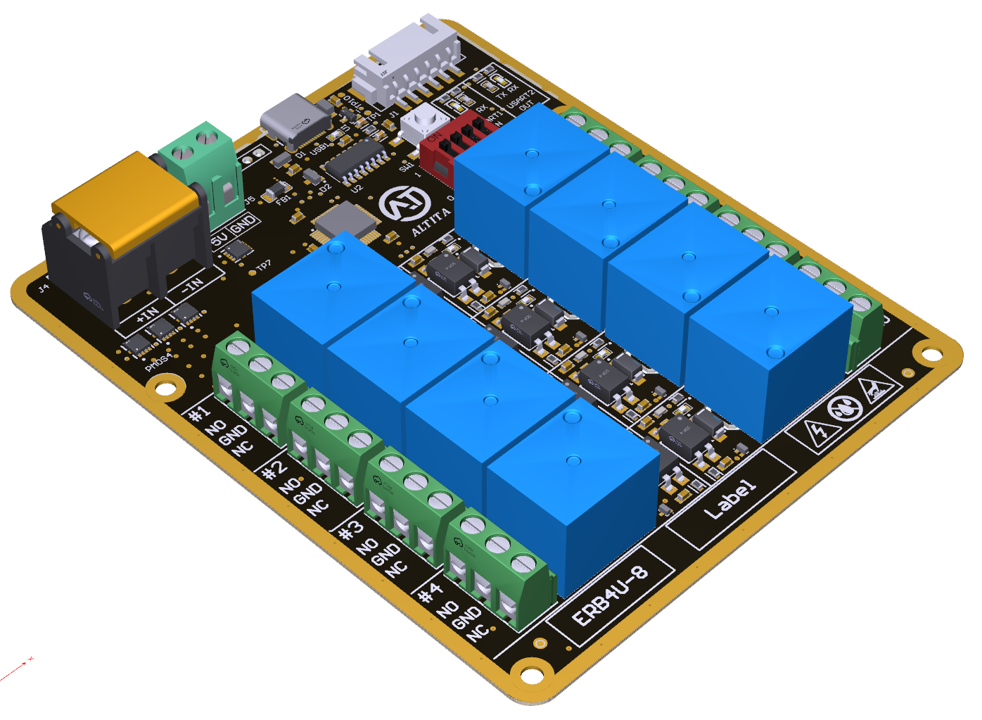

# ERB API & 例程代码

 

- [English](README.md)
- [中文](README.zh-CN.md)

* **ERB4U系列是一款可通过USART串口程控的继电器模块**
* **PC端仅需1根USB Type-C线，即可同时读取/控制多个串联的继电器模块**
* **每路继电器输出：** 最大30VDC/10A，1NO + 1NC
* **继电器总输出：** 最大30VDC/32A
* **工作原理：** ERB4U设备从USB或J1连接器（USART1）接收指令，并把原指令通过J6连接器（USART2）传递给下游ERB4U设备，实现可扩展功能。当接收到指令后，ERB4U会检查本机地址，只有当地址正确时，才会执行动作。
* **USART功能**
    - **USART参数：** 115200波特率，8数据位，1停止位，奇校验，无流控制
    - **读取：** 单个/多个ERB4U的温度，继电器状态，PN/SN等信息
    - **控制：** 单个/多个继电器状态
* **地址设定：** 4位拨码开关设定地址0 – 15，多个ERB4U可同时使用一个地址
* **保护电路**
    - 输入PMOS防反接
    - MCU与继电器光耦隔离
    - 可接阻性（R）或感性（L）负载
* **API & 例程代码：** Python API，完整例程代码
* **工作温度：** -40 to 85 ℃

<table style="width:100%; text-align:center;">
  <tr>
    <td style="width: 50%;">
      
    </td>
    <td style="width: 50%;">
      
    </td>
  </tr>
</table>

    

    

<table style="width:100%; text-align:center;">
  <tr>
    <td style="width: 50%;">
      
    </td>
    <td style="width: 50%;">
      
    </td>
  </tr>
</table>

## 通讯协议
### 读指令

  

### 写指令

  

### 故障信息

  

## 图纸
### 2D图纸：[下载](https://altita-tech.com/wp-content/uploads/ERB4U/ERB4U-8%202D.zip)
<table style="width:100%; text-align:center;">
  <tr>
    <td style="width: 50%; padding: 10px;">
      

        
      

    </td>
  </tr>
</table>

### 3D模型：[下载](https://altita-tech.com/wp-content/uploads/PBT223/PBT223%203D.zip)
<table style="width:100%; text-align:center;">
  <tr>
    <td style="width: 40%;">
      
    </td>
    <td style="width: 40%;">
      
    </td>
  </tr>
</table>

## 功能方框图
<table style="width:100%; text-align:center;">
  <tr>
    <td style="width: 100%;">
      
    </td>
  </tr>
</table>

## 视频教程

## 联系我们

  

    <ul style="list-style-type: disc; padding-left: 20px; margin: 0;">
      <li><strong>公司官网：</strong> <a href="https://altita-tech.com/">https://altita-tech.com/</a></li>
      <li><strong>销售：</strong> <a href="mailto:sales@altita-tech.com">sales@altita-tech.com</a></li>
      <li><strong>技术支持：</strong> <a href="mailto:tech@altita-tech.com">tech@altita-tech.com</a></li>
    </ul>
  

<table style="width:100%; text-align:center;">
  <tr>
    <td style="width: 100%;">
      
    </td>
  </tr>
</table>

